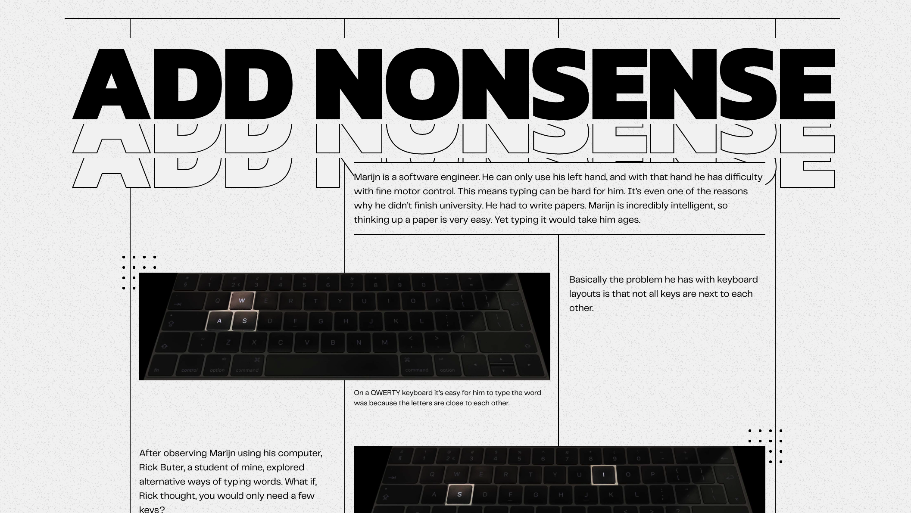

# CSS to the Rescue @cmda-minor-web 2020 - 2021

## Live demo
[Click here](https://gv-minorweb.github.io/css-to-the-rescue-2021/zengarden/)

## Zen Garden

[CSS Zen Garden](http://www.csszengarden.com/) was 20 jaar geleden een initiatief om mogelijkheden van CSS te exploreren: hoe kun je CSS inzetten om vaststaande HTML om te toveren tot toen een visueel meesterwerk. Aan jou dezelfde taak, maar dan anno nu.

In dit project geef ik een artikel vorm met alléén CSS, [het HTML bestand](zengarden/index.html) wordt niet aangepast.

### Context

Naast de vormgeving voor in de browser, hou ik rekening met de vormgeving bij het printen van de pagina, oftewel, flink los gaan in de browser, maar er voor zorgen dat alles wel netjes en leesbaar geprint kan worden.

### Eisen

Naast de print context die ik meeneem in mijn ontwerpbeslissingen probeer ik ook aan de volgende eisen te voldoen:

- [ ] SVG toepassen in shapes, masks én filters
- [ ] Voldoen aan Level AAA van de WCAG.

---

## Week 1

### Plan

In de eerste week doe ik vooral inspiratie op om een idee te krijgen van de richting waar ik met het artikel heen wil gaan. Ik wil extra aandacht aan de typografie besteden en ik maak een collectie van verschillende lettertypes die interessant om in te zetten. Overigens lijkt het me ook tof om Variable fonts te gebruiken (mits ik een passend lettertype tegenkom die een variable versie heeft), zodat ik bijvoorbeeld de font weights vloeiend kan animeren.

Voor de layout van het artikel zal ik hoofdzakelijk [CSS Grid](https://developer.mozilla.org/en-US/docs/Web/CSS/CSS_Grid_Layout) inzetten en het lijkt me enorm interessant om veel te experimenteren met [clip-path](https://developer.mozilla.org/en-US/docs/Web/CSS/clip-path).

#### Interessante lettertypes

**Gratis:**  
[Questrial](https://fonts.google.com/specimen/Questrial) (sans-serif, headings)  
[Poppins](https://fonts.google.com/specimen/Poppins) (sans-serif, headings)  
[Inter](https://fonts.google.com/specimen/Inter) (sans-serif, body)  
[EB Garamond](https://fonts.google.com/specimen/EB+Garamond) (serif, headings/body)

**Premium:**  
[Telegraf](https://pangrampangram.com/products/telegraf?variant=32840640167990) (sans-serif, headings/body)  
[Migra](https://pangrampangram.com/products/migra) (serif, headings/body)

--

### Schetsen

Interessant uitdaging, zonder de HTML aan te passen alle letters van de titel op elkaar stapelen:

 

Of dezelfde tekst puur met CSS meerdere keren op de pagina plaatsen op een stijlistische manier:

## Week 2

